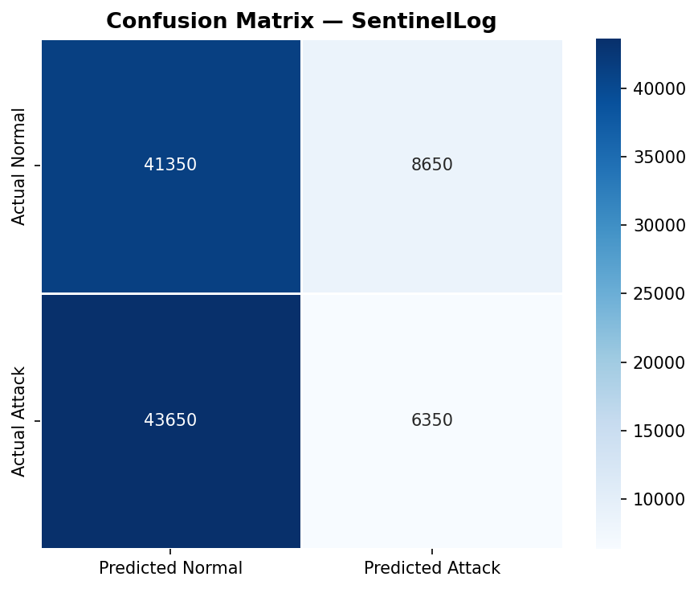
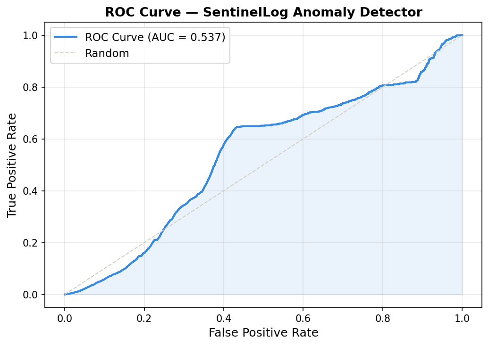
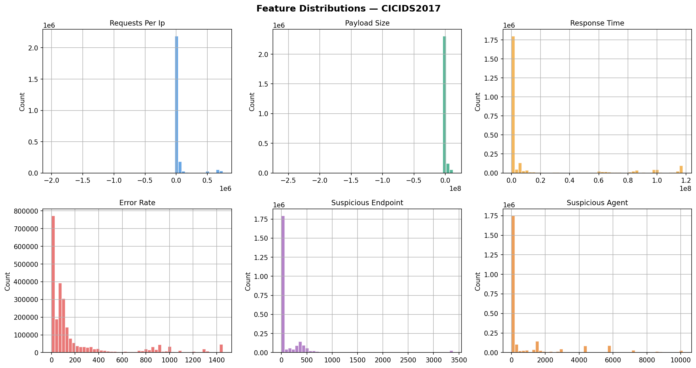
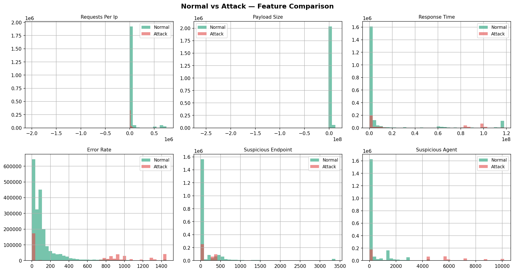

# 🛡️ SentinelLog — AI-Powered Log Anomaly Detector & Threat Explainer

> Real-time server log monitoring using Machine Learning + LLM-based threat explanation.
> Built as a cybersecurity portfolio project by [Sayan Mandal](https://codersayan.vercel.app/)


---

## 🔴 Live Demo

| Component | Link |
|---|---|
| 🖥️ Dashboard | [sentinellog.streamlit.app](https://sentinelog-codersayan0.streamlit.app) |
| ⚙️ Backend API | [sentinellog-backend.onrender.com](https://sentinelog.onrender.com) |
| 📄 API Docs | [sentinellog-backend.onrender.com/docs](https://sentinelog.onrender.com/docs) |

---

## 📌 What is SentinelLog?

Most security tools use **rule-based detection** — they only catch threats they were explicitly programmed to find. SentinelLog is different.

It uses **Machine Learning** to detect unknown anomalies in server logs — patterns it was never told to look for — then uses an **LLM (Gemini)** to explain threats in plain English with severity scoring and specific remediation steps. This is exactly how real SOC (Security Operations Center) tools work.

---

## 🎯 Features

- ✅ Real-time log ingestion and parsing
- ✅ ML anomaly detection — no rules needed (Isolation Forest)
- ✅ LLM threat explainer — plain English + severity + remediation
- ✅ AbuseIPDB integration — global IP reputation lookup
- ✅ Live Streamlit dashboard with 4 pages
- ✅ REST API with FastAPI — documented at `/docs`
- ✅ SQLite alert history database
- ✅ Synthetic log generator for testing
- ✅ Live log streamer — simulates 24/7 traffic
- ✅ Docker Compose — one command runs everything
- ✅ Trained on real CICIDS2017 cybersecurity dataset

---

## 🏗️ Architecture

```
Log Sources (nginx / app / Docker)
          ↓
   Log Ingestor & Parser
          ↓
   ML Anomaly Detector
   (Isolation Forest — CICIDS2017)
      ↙         ↘
  Normal       Flagged
  (logged)     (anomalies only)
                  ↓
          AbuseIPDB IP Lookup
          (global threat intel)
                  ↓
          LLM Threat Explainer
          (LangChain + Gemini API)
                  ↓
       FastAPI Backend (/alerts)
       SQLite Database
                  ↓
       Streamlit Dashboard
       (4 pages — live monitoring)
```

---

## 🖥️ Dashboard Pages

| Page | What you see |
|---|---|
| Dashboard | Metric cards, severity pie chart, threat types, top flagged IPs |
| Alert Feed | Every threat with full AI explanation and remediation |
| Raw Logs | Searchable live log table, color-coded by status code |
| Analytics | Score distribution, severity over time, IP summary table |

---

## 🛠️ Tech Stack

| Layer | Technology |
|---|---|
| ML Model | scikit-learn — Isolation Forest |
| Dataset | CICIDS2017 (real network intrusion data) |
| LLM Chain | LangChain 0.3 + Google Gemini API |
| Threat Intel | AbuseIPDB API |
| Backend | FastAPI + SQLite + SQLAlchemy |
| Frontend | Streamlit |
| Data Processing | Pandas + NumPy |
| Containerization | Docker + Docker Compose |
| Deployment | Render (API) + Streamlit Cloud (Dashboard) |

---

## 📁 Project Structure

```
SentinelLog/
├── backend/
│   ├── main.py               # FastAPI app — all routes
│   ├── log_ingestor.py       # Log parser + feature engineering
│   ├── anomaly_detector.py   # Isolation Forest ML model
│   ├── llm_explainer.py      # LangChain + Gemini threat explainer
│   ├── abuseipdb.py          # AbuseIPDB IP reputation lookup
│   ├── log_generator.py      # Synthetic log generator
│   ├── models.py             # Pydantic data models
│   ├── database.py           # SQLite DB setup
│   └── requirements.txt
│
├── dashboard/
│   ├── app.py                # Streamlit dashboard (4 pages)
│   ├── Dockerfile
│   └── requirements.txt
│
├── logs/
│   ├── generate_sample_logs.py   # Generates 5000 sample logs
│   ├── live_log_streamer.py      # Simulates 24/7 live traffic
│   ├── sample_access.log         # Generated sample logs
│   └── sample_attacks.log        # Pure attack traffic
│
├── models/
│   ├── isolation_forest.pkl      # Trained ML model
│   └── scaler.pkl                # Feature scaler
│
├── notebook/
│   ├── train_model.ipynb         # Model training + evaluation
│   ├── data/
│   │   └── cicids2017_cleaned.csv
│   └── outputs/
│       ├── confusion_matrix.png
│       ├── correlation_heatmap.png
│       ├── feature_distributions.png
│       ├── normal_vs_attack.png
│       └── roc_curve.png
│
├── .env.example
├── .gitignore
├── docker-compose.yml
├── Dockerfile
└── README.md
```

---

## ⚡ Quick Start

### Prerequisites

- Python 3.11+
- Docker Desktop (optional)
- Free API keys (see below)

### Step 1 — Clone the repo

```bash
git clone https://github.com/codersayan0/SentinelLog.git
cd SentinelLog
```

### Step 2 — Set up environment

```bash
cp .env.example .env
# Edit .env and add your API keys
```

### Step 3 — Install dependencies

```bash
cd backend
pip install -r requirements.txt

cd ../dashboard
pip install -r requirements.txt
```

### Step 4 — Generate sample logs

```bash
cd ../logs
pip install faker
python generate_sample_logs.py
```

### Step 5 — Train ML model

```bash
cd ../backend
python anomaly_detector.py
```

### Step 6 — Start backend

```bash
uvicorn main:app --reload
```

### Step 7 — Trigger analysis

```bash
# PowerShell
Invoke-WebRequest -Uri http://127.0.0.1:8000/analyze -Method POST

# Or open Swagger UI
http://127.0.0.1:8000/docs
```

### Step 8 — Start dashboard

```bash
cd ../dashboard
streamlit run app.py
```

### Step 9 — Open browser

```
Dashboard  → http://localhost:8501
API        → http://localhost:8000
API Docs   → http://localhost:8000/docs
```

---

## 🐳 Docker (one command)

```bash
cp .env.example .env
# Add your API keys to .env

docker-compose up --build
```

| Service | URL |
|---|---|
| Dashboard | http://localhost:8501 |
| API | http://localhost:8000 |
| API Docs | http://localhost:8000/docs |

---

## 🔑 Free API Keys

| API | Link | Free Limit |
|---|---|---|
| Gemini API | [aistudio.google.com](https://aistudio.google.com) | 1500 req/day |
| AbuseIPDB | [abuseipdb.com/register](https://www.abuseipdb.com/register) | 1000 checks/day |

Both completely free. No credit card required.

---

## 📊 Dataset

Trained on real cybersecurity data:

| Dataset | Link | Contains |
|---|---|---|
| CICIDS2017 Cleaned | [Kaggle](https://www.kaggle.com/datasets/ericanacletoribeiro/cicids2017-cleaned-and-preprocessed) | DDoS, Brute Force, SQL Injection, Port Scan, Botnet |

2.5M+ real network flow records — not simulated data.

---

## 🌐 API Endpoints

| Method | Endpoint | Description |
|---|---|---|
| GET | `/` | Health check |
| GET | `/logs` | View raw parsed logs |
| POST | `/analyze` | Trigger ML + LLM analysis |
| GET | `/alerts` | Get all threat alerts |
| GET | `/alerts?severity=critical` | Filter by severity |
| GET | `/stats` | Summary statistics |
| POST | `/train` | Retrain ML model |

---

## 🔒 Detected Threat Types

| Threat | Detection Method |
|---|---|
| Brute Force | High error rate + repeated POST to login endpoints |
| SQL Injection | Suspicious endpoint patterns + slow response |
| DDoS | Very high requests + high response time |
| Reconnaissance | Known scanner agents + probing attack endpoints |
| Data Exfiltration | Abnormally large outgoing payload |
| Port Scan | High connection rate + low payload size |

---

## 📸 Screenshots

| Dashboard | Alert Feed |
|---|---|
|  |  |

| Feature Distribution | Normal vs Attack |
|---|---|
|  |  |

> Replace with actual dashboard screenshots after deployment.

---

## 🚀 Deployment

### Backend → Render

```
1. Go to render.com → New Web Service
2. Connect GitHub repo
3. Root Dir     : backend
4. Build Cmd    : pip install -r requirements.txt
5. Start Cmd    : uvicorn main:app --host 0.0.0.0 --port 8000
6. Port         : 8000
7. Add env vars : GEMINI_API_KEY, ABUSEIPDB_KEY, LOG_FILE
```

### Dashboard → Streamlit Cloud

```
1. Go to share.streamlit.io
2. Connect GitHub repo
3. Main file    : dashboard/app.py
4. Add secrets  : GEMINI_API_KEY, ABUSEIPDB_KEY, BACKEND_URL
```

---

## 💡 How It Works

**1. Log Ingestion** — Logs are parsed using regex into structured rows with IP, endpoint, status code, response time, and payload size.

**2. Feature Engineering** — Raw fields transform into ML features: requests per IP, error rate, response time, payload size, suspicious endpoints, suspicious user agents.

**3. Anomaly Detection** — Isolation Forest scores every entry. Entries deviating from normal patterns get flagged — even attack types never seen before.

**4. Threat Explanation** — Flagged entries go to LangChain + Gemini with the raw log, anomaly score, and AbuseIPDB report. Returns structured JSON with threat type, severity, explanation, and remediation.

**5. Dashboard** — Streamlit polls FastAPI `/alerts` every 30 seconds and renders live threat feed, charts, and IP analysis.

---

## 🤝 Connect

**Sayan Mandal** — B.Tech CSE, SVIST (2023–2027)

[](https://codersayan.vercel.app/)
[](https://github.com/codersayan0)
[](https://www.linkedin.com/in/sayanmandal)
[](mailto:sayanmandal1253@gmail.com)

---

## 📄 License

MIT License — free to use, modify, and distribute.

---

⭐ **Star this repo if it helped you!**